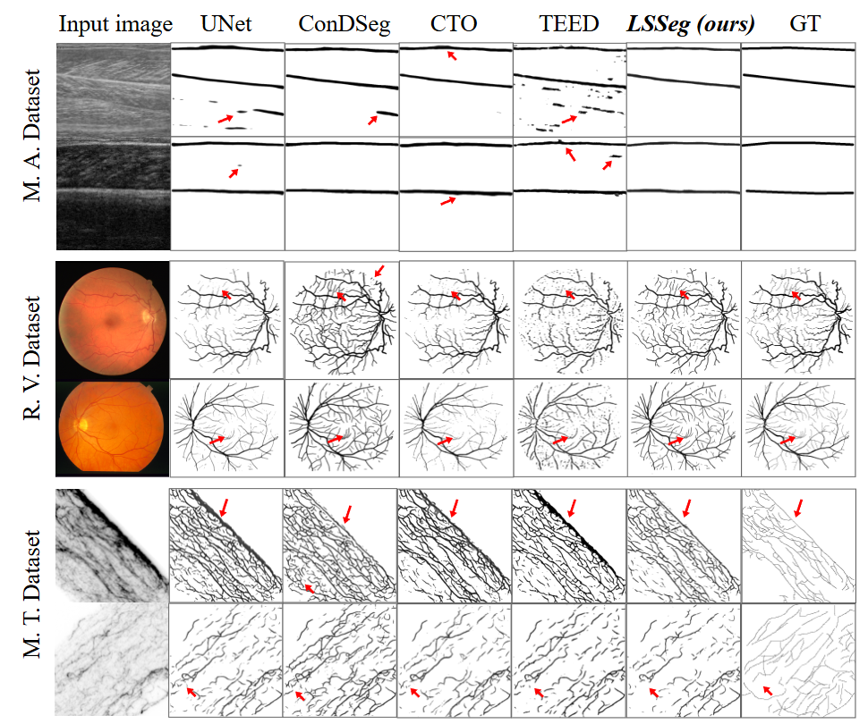
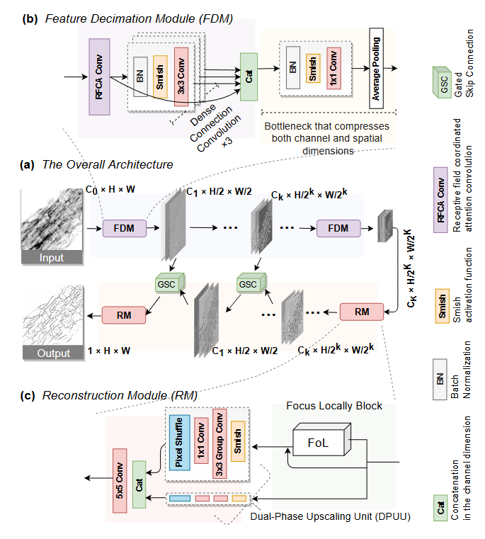

# LSSeg: An Efficient Hierarchical Network for Segmentation of Linear Structures in Biomedical Images

[](https://opensource.org/licenses/MIT)

## Abstract

Accurate segmentation of line-like structures in biomedical images (e.g., vasculature, muscle fibers) is critical, for their morphology, density, and connectivity serve as vital biomarkers for analysis, yet it remains challenging. Mainstream segmentation models have massive scale and produce fragment filamentous structures, while specialized methods often require complex post-processing. Therefore, we propose Line-like Structure Segmentation Network (LSSeg), an ultra-lightweight hierarchical architecture (28K parameters) that directly outputs predictions for this specific task. LSSeg uniquely integrates segmentation and edge detection strengths by combining multi-level feature perception (via Feature Decimation Modules) with locally aware reconstruction (via Focus Locally Block) to achieve high-quality output while maintaining extreme efficiency (2.1 GFLOPs). Experiments across diverse datasets (retinal vessels, muscle aponeurosis, microtubule) show LSSeg outperforms universal segmentation models as well as edge detection models.


<p align="center">
  
</p>

*<center>Visualized results of different models on three biomedical images datasets. As the arrows highlighting, our LSSeg outperforms peers with higher precision (e.g., GT-aligned masks on Muscle aponeurosis), superior local continuity (e.g., low-contrast retinal vessels), and cleaner outputs (e.g., noise-robust results on ambiguous Microtubule data).</center>*


## Architectures

<p align="center">
  
</p>

*<center>The architectures this study proposed: **(a)** Line-like Structure Segmentation Network (LSSeg), **(b)** the Feature Decimation Module (FDM), and **(c)** the Reconstruction Module (RM). The lightweight model LSSeg employs an encoder-decoder architecture, using FDMs to hierarchically extract lines' features and RMs to progressively reconstruct the result. Gated Skip Connections (GSC) enhance communication across layers, enabling end-to-end computation that directly outputs single-channel predictions from multi-channel inputs.</center>*


## Project Structure

```
LSSeg/
├── ablation.py        # Ablation studies implementation
├── config.yaml        # Configuration file for training
├── data/              # Data directory
│   └── data_sample/   # Sample data for testing
├── dataset.py         # Dataset loading and processing
├── eval.py            # Model evaluation utilities
├── loss.py            # Loss functions
├── models/            # Model definitions
│   ├── ab.py          # Ablation model variants
│   ├── layers.py      # Core network layers
│   ├── lsseg.py       # Main LSSeg model
│   ├── rfa_conv.py    # Receptive Field Attention Convolution
│   └── ska.py         # SKAttention implementation
├── predict.py         # Prediction script
├── train.py           # Training script
└── utils.py           # Utility functions
```


## Installation

1. Clone this repository:
   ```bash
   git clone https://github.com/BM-AI-Lab/LSSeg.git
   cd LSSeg
   ```

2. Install the required dependencies:
   ```bash
   pip install -r requirements.txt
   ```

## Usage

### Training

1. Configure the training parameters in `config.yaml`:
   ```yaml
   batch_size: 8
   data_pair_file: data/tubulin/pairs.csv
   image_mode: L
   in_channels: [1, 8, 8]
   lr: 0.01
   num_epochs: 100
   resize: [512, 512]
   ```

2. Run the training script:
   ```bash
   python train.py
   ```

### Prediction

Use the pre-trained model to make predictions on new images:

```bash
python predict.py
```

To use your own data:

1. Modify the following parameters in `predict.py`:
   ```python
   # Choose device (CPU or GPU)
   device = torch.device('cuda' if torch.cuda.is_available() else 'cpu')
   
   # Initialize model with appropriate parameters
   model = LSSeg(in_channels=[1, 8, 8])
   
   # Path to model weights
   checkpoint_path = 'path/to/your/model/weights.params'
   
   # Path to your images and image mode ('L' for grayscale, 'RGB' for color)
   images = load_images(image_folder='path/to/your/images', mode='L')
   
   # Path to save results
   save_images(preds, folder='path/to/save/results')
   ```

2. Supported image modes:
   - `'L'` for grayscale images (used for tubulin and muscle datasets)
   - `'RGB'` for color images (used for vessels dataset)

### Evaluation

To evaluate a trained model, use the evaluation functionality in `eval.py`:

```bash
python eval.py
```

The model performance is evaluated using several metrics:

- **ODS (Optimal Dataset Scale)**: Maximum F1 score across all thresholds
- **OIS (Optimal Image Scale)**: Average of maximum F1 scores per image
- **Dice**: Standard Dice coefficient
- **IoU**: Intersection over Union
- **MSE/MAE**: Mean Squared/Absolute Error
- **PSNR**: Peak Signal-to-Noise Ratio

## Datasets

The framework supports various line-like structure segmentation datasets:

- **Tubulin**: Microtubule segmentation data
- **Muscle**: Muscle fiber segmentation data
- **Vessels**: Blood vessel segmentation data

### Dataset Preparation

1. Organize your data in the following structure:
   ```
   data/
   └── your_dataset/
       ├── images/      # Input images
       ├── labels/      # Ground truth masks
       └── pairs.csv    # CSV file with image-label pairs
   ```

2. The `pairs.csv` file should have two columns (no headers) - the first with image paths and the second with corresponding label paths:
   ```
   images/img01.png,labels/img01.png
   images/img02.png,labels/img02.png
   ```

3. Modify the `config.yaml` file to point to your dataset.

Sample data is provided in the `data/data_sample/` directory for testing purposes.

## Ablation Studies

The repository includes ablation studies to evaluate the contribution of different components:

```bash
python ablation.py
```

## Results

### Model Weights

Trained model weights are available in the `log/` directory for different datasets:

- `log/LSSeg188_tubulin/` - Model trained on tubulin dataset
- `log/LSSeg188_muscle/` - Model trained on muscle dataset
- `log/LSSeg388_vessels/` - Model trained on vessels dataset


### Visualization

The training script automatically saves sample predictions during training. You can find these visualizations in the corresponding log directory for each experiment.

<!-- ## Citation

If you use this code in your research, please cite our paper:
```
@article{lssseg_biomedical2023,
  title={An Efficient Hierarchical Network for Segmentation of Linear Structures in Biomedical Images},
  author={Your Author Names},
  journal={Journal Name},
  year={2023},
  volume={xx},
  number={xx},
  pages={xx--xx},
  doi={your_doi_here}
}
``` -->
